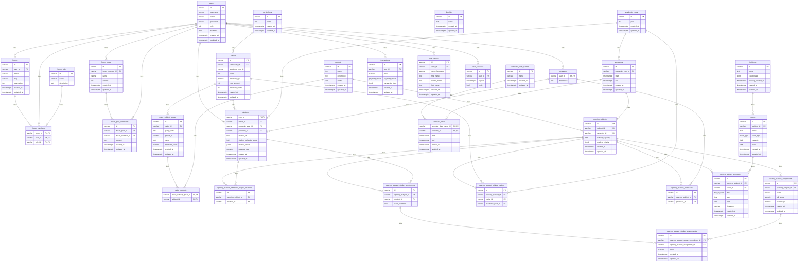

```mermaid
erDiagram
  academic_years {
    varchar id PK
    int4 year
    timestamptz created_at
    timestamptz updated_at
  }

  buildings {
    varchar id PK
    text name
    point coordinates
    timestamptz building_created_at
    timestamptz created_at
    timestamptz updated_at
  }

  curriculums {
    varchar id PK
    text name
    timestamptz created_at
    timestamptz updated_at
  }

  faculties {
    varchar id PK
    text name
    timestamptz created_at
    timestamptz updated_at
  }

  forum_members {
    varchar forum_id PK,FK
    varchar user_id PK,FK
    varchar role_id PK,FK
  }

  forum_post_comments {
    varchar id PK
    varchar forum_post_id FK
    varchar forum_member_id FK
    text content
    timestamptz created_at
    timestamptz updated_at
  }

  forum_posts {
    varchar id PK
    varchar forum_member_id FK
    varchar name
    text content
    timestamptz created_at
    timestamptz updated_at
  }

  forum_roles {
    varchar id PK
    varchar name
    text description
  }

  forums {
    varchar id PK
    varchar user_id FK
    varchar name
    varchar slug
    text description
    timestamptz created_at
    timestamptz updated_at
  }

  major_subject_groups {
    varchar id PK
    varchar major_id FK
    int4 group_index
    varchar parent_id
    text name
    numeric minimum_credit
    timestamptz created_at
    timestamptz updated_at
  }

  major_subjects {
    varchar major_subject_group_id PK,FK
    varchar subject_id PK,FK
  }

  majors {
    varchar id PK
    varchar curriculum_id FK
    varchar academic_year_id
    text name
    numeric minimum_gpa
    int2 year_amount
    int4 minimum_credit
    timestamptz created_at
    timestamptz updated_at
  }

  opening_subject_additional_eligible_students {
    varchar id PK
    varchar opening_subject_id FK
    varchar student_id FK
  }

  opening_subject_assignments {
    varchar id PK
    varchar opening_subject_id FK
    varchar name
    numeric full_score
    numeric percentage
    timestamptz created_at
    timestamptz updated_at
  }

  opening_subject_eligible_majors {
    varchar id PK
    varchar opening_subject_id FK
    varchar major_id FK
    varchar academic_year_id FK
  }

  opening_subject_professors {
    varchar id PK
    varchar opening_subject_id FK
    varchar professor_id FK
  }

  opening_subject_schedules {
    varchar id PK
    varchar opening_subject_id FK
    varchar room_id FK
    day_of_week day
    time start
    time end
    varchar timezone
    timestamptz created_at
    timestamptz updated_at
  }

  opening_subject_student_assignments {
    varchar id PK
    varchar opening_subject_student_enrollment_id FK
    varchar opening_subject_assignment_id FK
    numeric score
    timestamptz created_at
    timestamptz updated_at
  }

  opening_subject_student_enrollments {
    varchar id PK
    varchar opening_subject_id FK
    varchar student_id FK
    text class_comment
  }

  opening_subjects {
    varchar id PK
    varchar subject_id FK
    varchar semester_id FK
    int4 subject_capacity
    jsonb grading_criteria
    timestamptz created_at
    timestamptz updated_at
  }

  professors {
    varchar user_id PK,FK
    text description
  }

  rooms {
    varchar id PK
    varchar building_id FK
    text name
    room_type room_type
    int4 capacity
    int4 floor
    timestamptz created_at
    timestamptz updated_at
  }

  semester_date_names {
    varchar id PK
    varchar name
    timestamptz created_at
    timestamptz updated_at
  }

  semester_dates {
    varchar semester_date_name_id PK,FK
    varchar semester_id PK,FK
    timestamptz start
    timestamptz end
    timestamptz created_at
    timestamptz updated_at
  }

  semesters {
    varchar id PK
    varchar academic_year_id FK
    timestamptz start
    timestamptz end
    timestamptz created_at
    timestamptz updated_at
  }

  students {
    varchar user_id PK,FK
    varchar major_id FK
    varchar academic_year_id FK
    varchar professor_id FK
    text student_id
    int4 student_behavior_score
    jsonb student_status
    numeric previous_gpa
    timestamptz created_at
    timestamptz updated_at
  }

  subjects {
    varchar id PK
    text name
    text description
    int4 credit
    timestamptz created_at
    timestamptz updated_at
  }

  transactions {
    varchar id PK
    varchar user_id FK
    numeric price
    payment_status payment_status
    jsonb transaction_type
    timestamptz created_at
    timestamptz updated_at
  }

  user_names {
    varchar id PK
    varchar user_id FK
    varchar name_language
    text first_name
    text middle_name
    text last_name
    timestamptz created_at
    timestamptz updated_at
  }

  user_sessions {
    varchar id PK
    varchar user_id FK
    timestamptz expires
    bool fresh
  }

  users {
    varchar id PK
    varchar username
    varchar email
    varchar password
    role role
    date birthdate
    timestamptz created_at
    timestamptz updated_at
  }

    forums ||--o{ forum_members : links
    users ||--o{ forum_members : links
    forum_roles ||--o{ forum_members : links
    forum_posts ||--o{ forum_post_comments : links
    users ||--o{ forum_post_comments : links
    users ||--o{ forum_posts : links
    users ||--o{ forums : links
    majors ||--o{ major_subject_groups : links
    major_subject_groups ||--o{ major_subjects : links
    subjects ||--o{ major_subjects : links
    curriculums ||--o{ majors : links
    opening_subjects ||--o{ opening_subject_additional_eligible_students : links
    students ||--o{ opening_subject_additional_eligible_students : links
    opening_subjects ||--o{ opening_subject_assignments : links
    opening_subjects ||--o{ opening_subject_eligible_majors : links
    majors ||--o{ opening_subject_eligible_majors : links
    academic_years ||--o{ opening_subject_eligible_majors : links
    opening_subjects ||--o{ opening_subject_professors : links
    professors ||--o{ opening_subject_professors : links
    opening_subjects ||--o{ opening_subject_schedules : links
    rooms ||--o{ opening_subject_schedules : links
    opening_subject_student_enrollments ||--o{ opening_subject_student_assignments : links
    opening_subject_assignments ||--o{ opening_subject_student_assignments : links
    opening_subjects ||--o{ opening_subject_student_enrollments : links
    students ||--o{ opening_subject_student_enrollments : links
    subjects ||--o{ opening_subjects : links
    semesters ||--o{ opening_subjects : links
    users ||--o{ professors : links
    buildings ||--o{ rooms : links
    semester_date_names ||--o{ semester_dates : links
    semesters ||--o{ semester_dates : links
    academic_years ||--o{ semesters : links
    users ||--o{ students : links
    majors ||--o{ students : links
    academic_years ||--o{ students : links
    professors ||--o{ students : links
    users ||--o{ transactions : links
    users ||--o{ user_names : links
    users ||--o{ user_sessions : links
```
